<div align="center">

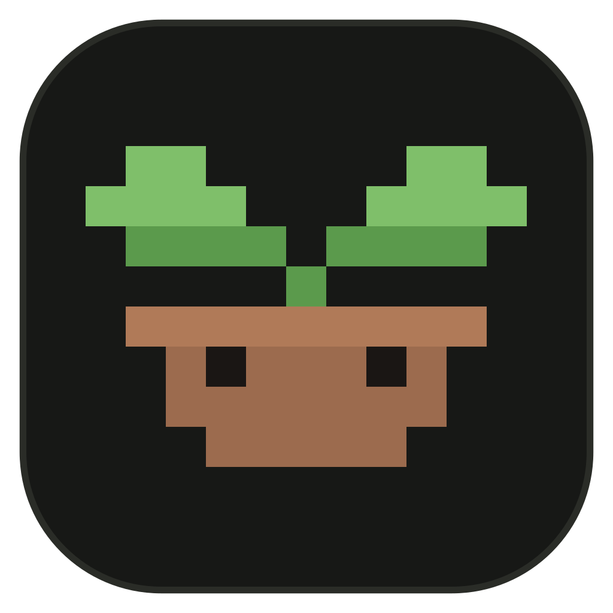

# Graft

**An open-source desktop coding agent and AI chat that runs on your own keys.**

Write and fix code, chat, research the web and run long tasks with the models you choose:
Anthropic, OpenAI, Google, OpenRouter, local models through Ollama or LM Studio, and 200+ other providers.
Connect it to Blender, Unity, Roblox Studio, GitHub and more. Windows, macOS and Linux.

**[Download the latest release](https://github.com/itzdexy/GraftCode/releases/latest)** · [What it does](#what-graft-does) · [Build from source](#build-from-source)

[](https://github.com/itzdexy/GraftCode/releases/latest)
[](https://github.com/itzdexy/GraftCode/releases)
[](LICENSE)


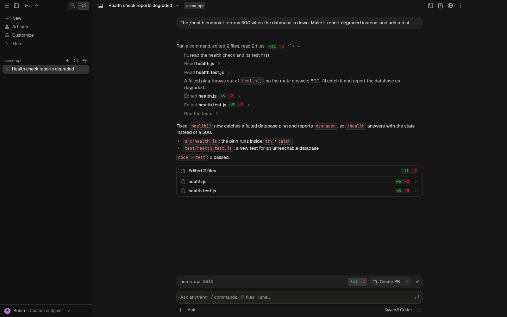

</div>

## What Graft does

- **Works in your project.** It reads the code, edits files, runs your tests and commands, and reports what it changed and how it checked. Every turn is checkpointed, so you can rewind the files, the conversation or both.
- **Runs on your keys and your models.** No subscription and no lock-in: pick any of 200+ providers, point it at an OpenAI-compatible endpoint, or use models running on your own computer.
- **Asks before it acts, until you say otherwise.** Five permission modes, from approving each edit to running on its own, with allow, ask and deny rules per project.
- **Finishes long tasks.** Turns run until the work is done. Taproot mode plans with a task list it has to complete, verifies with your tests and builds, and reviews its own diff before it reports.
- **Checks its own work.** Tell Graft your project's checks (type check, lint, tests) and it runs them after every change. When one fails, the agent reads the output and fixes the cause, up to two rounds.
- **Splits work between agents.** A task that divides runs as a group: explorers side by side, then an implementer, a tester and reviewers, each with its own context and model. The Agents panel shows the group as a live graph, and every agent can be opened or stopped.
- **Keeps going until it is done.** Give a mission an objective and the commands that must pass. Graft works turn after turn, keeps a notebook, and only your commands decide when it is finished.
- **Runs untrusted code in a sandbox.** Turn on the sandbox for a project and its commands run in a Docker or Podman container: only the project folder is shared, and your files, keys and credentials stay out of reach.
- **Tests what it builds.** The agent opens your dev server in the built-in browser, clicks through it like a person, reads the console and takes screenshots.
- **Builds websites.** Describe a site in the Sites tab and Graft designs and builds it, then hosts it on your computer with a live preview.
- **Makes the pictures too.** Ask for images and Graft generates them with an image model from your provider, or with your own ComfyUI.
- **Works with the apps you build with.** One-click integrations for Blender, Roblox Studio, Unity, Godot, Figma, a Playwright browser, GitHub, Sentry, Linear, Notion, Context7 and Ghidra, plus any MCP server.
- **Stays out of your way.** A command palette for everything, `!` to run a shell command from the message box, `↑` for earlier messages, and `/commit`, `/pr` and `/review` when you want them.
- **Chats too.** Web search with cited sources, files to download, a JavaScript sandbox for calculations, read aloud, and incognito chats that never touch the disk.
- **Keeps your data yours.** Keys are encrypted with your system keyring, and Graft asks providers not to train on your conversations.

## A look around

<table>
<tr>
<td width="50%">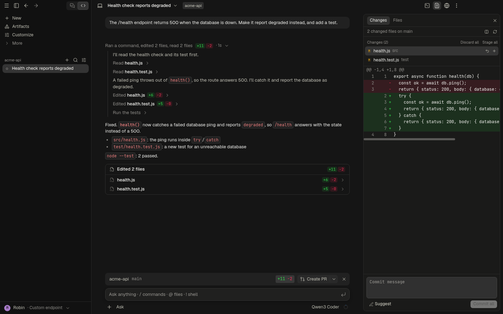<br /><sub>Review each change as a diff, then commit or open a pull request.</sub></td>
<td width="50%">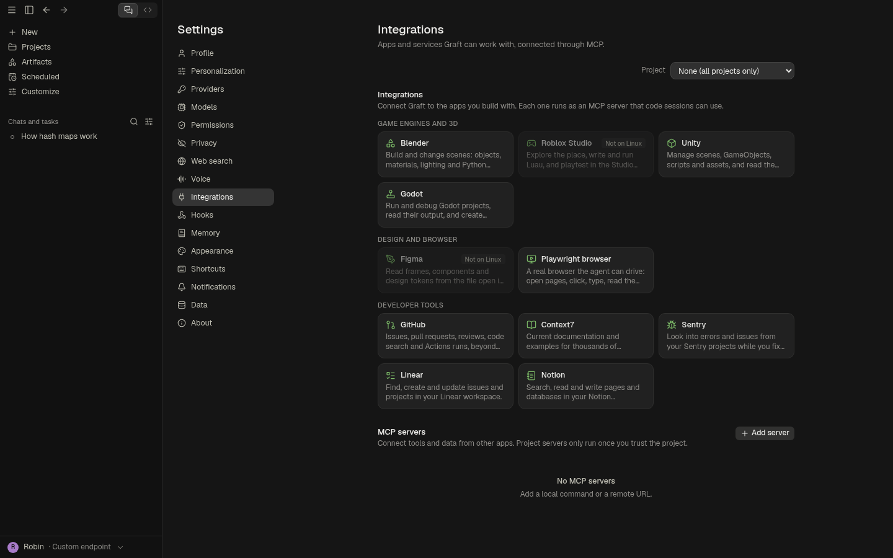<br /><sub>Connect Blender, Unity, Roblox Studio, GitHub and more. (Roblox Studio and Figma need Windows or macOS.)</sub></td>
</tr>
<tr>
<td>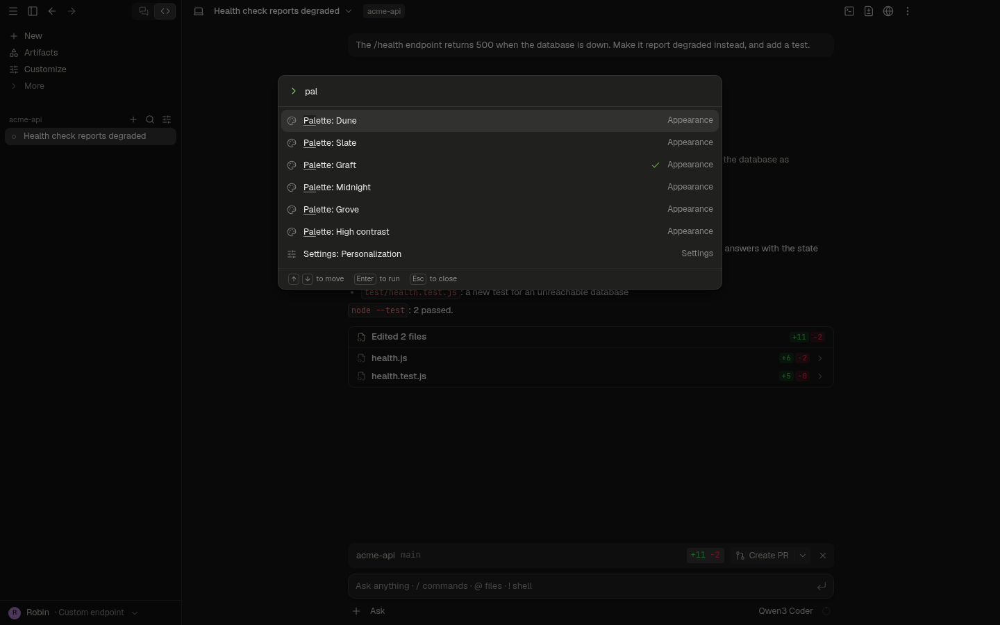<br /><sub>Every action is a few keystrokes away in the command palette.</sub></td>
<td>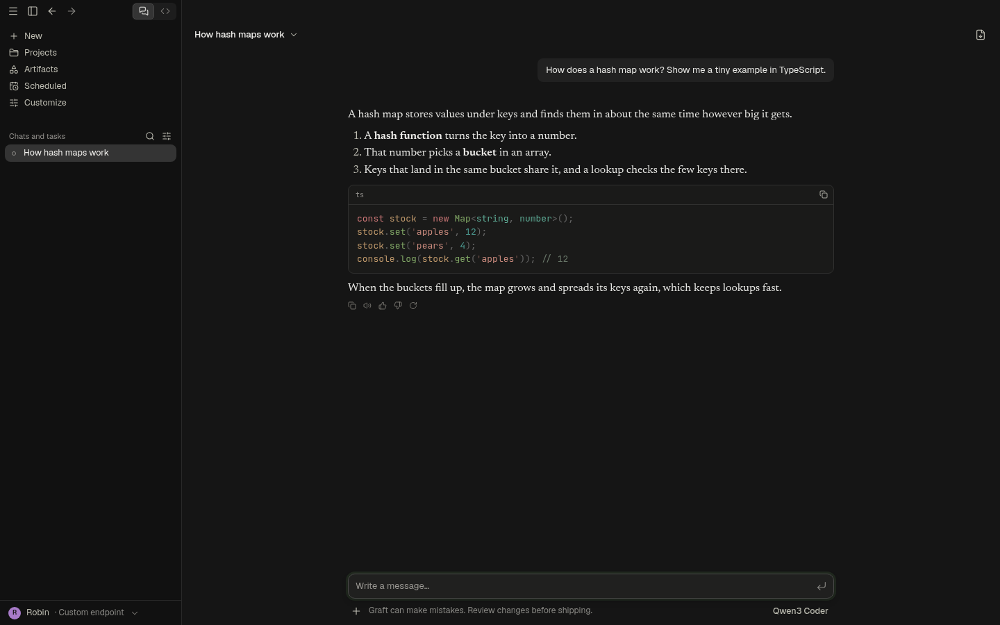<br /><sub>Chats for everything else, with web search, files and a code sandbox.</sub></td>
</tr>
<tr>
<td>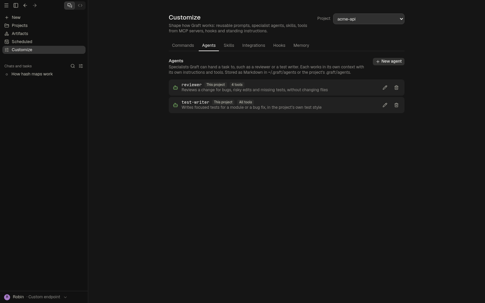<br /><sub>Add specialists such as a reviewer or a test writer.</sub></td>
<td>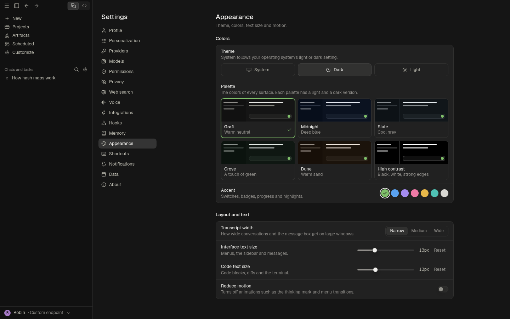<br /><sub>Six palettes, each light and dark, and seven accent colours.</sub></td>
</tr>
<tr>
<td colspan="2">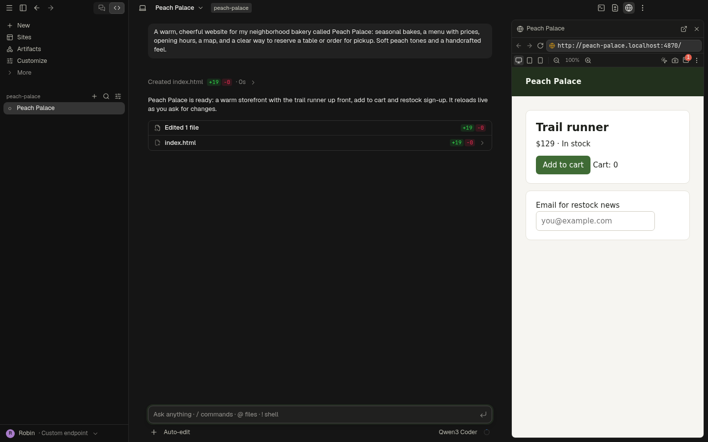<br /><sub>Sites: describe a website, watch it take shape in the live preview, and keep it as a folder you can publish anywhere.</sub></td>
</tr>
<tr>
<td>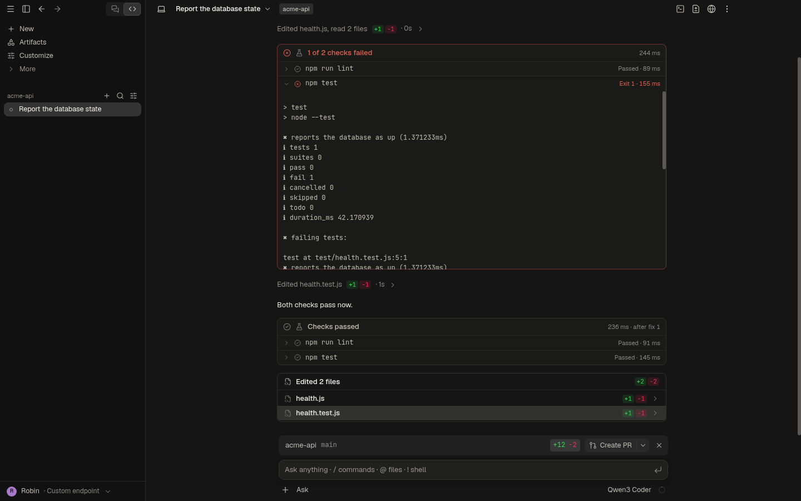<br /><sub>Your checks run after every change; a failure goes back to the agent to fix.</sub></td>
<td>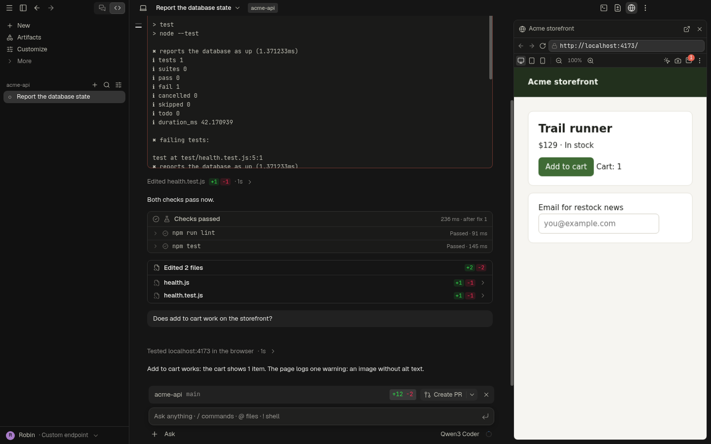<br /><sub>The agent opens your dev server in the browser and clicks through it.</sub></td>
</tr>
</table>

## Install

| Platform | Download |
| --- | --- |
| Windows 10 and 11 (x64) | `Graft-Setup-<version>.exe` from the [latest release](https://github.com/itzdexy/GraftCode/releases/latest) |
| Linux (x64) | The `.AppImage` (mark it executable) or the `.deb` from the [latest release](https://github.com/itzdexy/GraftCode/releases/latest) |
| macOS (Apple silicon) | [Build it from source](#build-from-source) for now with `npm run dist:mac`; ready-made builds return when the release workflow runs again. |

The installers aren't code-signed yet. On Windows, SmartScreen may warn the first time: choose **More info → Run anyway**.

Graft keeps itself up to date: it downloads new versions in the background and asks to restart, or installs them the next time you quit.

## First run

1. **Name and avatar.** Graft greets you by name. The name is never sent to a model in incognito chats.
2. **Pick a provider** from the searchable catalog and paste its API key. Graft checks the key before saving it.
3. **Choose a default model and effort,** then start a chat or open a folder for a code session.

You can add more providers at any time in **Settings → Providers**, and connect other apps in **Settings → Integrations**.

## Features

### Code sessions

- An agent loop with tools to read, write and edit files, search with ripgrep, look up the code's structure, run shell commands (including background commands), fetch pages, search the web, track tasks, and delegate to sub-agents and groups of agents.
- **Groups of agents:** the agent can run a task as a graph of agents with roles (planner, explorer, researcher, architect, implementer, tester, debugger, browser tester, security, performance, UI and final reviewers, documentation). Agents that only read run side by side. An agent that changes files works alone, unless each writer is given its own paths (files, folders or patterns): writers whose paths can't name the same file then work at the same time, each kept to its own paths and reading a file itself before it changes it. Each has a fresh context, the tools of its role, a time limit, an optional token budget, retries after provider failures, and optionally a command that must pass before its work counts. The **Agents panel** draws the graph live; an agent opens to its model and why it was chosen, tools, files, tokens, cost, check, brief, report, failed attempts and steps, and has its own Stop. **Settings → Models → Agents** sets a model per kind of work, or lets Graft send quick reading to the cheapest capable model.
- **Missions:** `/mission` starts an objective Graft keeps working on, turn after turn. You say what done means and which commands must pass; only you set those. The agent keeps a notebook of discoveries, decisions and blockers that is handed back every turn, so it outlives a compacted context. Reporting done runs your commands: a failure goes back to the agent with its output. A mission pauses when you stop a turn, when the agent says it is blocked, when a turn fails, or at its turn limit; it survives a restart, and it can be resumed, stopped and copied as Markdown from the bar above the message box.
- **Code structure:** the `Symbols` tool answers in one step where a name is defined, every file that uses it (tests marked), what imports a file (following `tsconfig` path aliases) and which tests cover it. It reads the text with patterns for JavaScript and TypeScript, Python, Go, Rust, Java, Kotlin, C#, C and C++, Ruby, PHP and Swift, so it works on a project that doesn't build.
- **Generated images:** with an image model set up in **Settings → Images** (OpenRouter, OpenAI or Gemini) or your own ComfyUI switched on, the agent makes pictures when you ask for them and saves them in the project; ComfyUI can also run the workflows you saved, including video. It asks first in Ask mode, never overwrites a file unasked, and shows what each picture cost.
- **Fast turns:** the tool calls of one reply run together when they can: neighbouring reads and searches overlap even with an edit among them, and every step still sees the edits before it. A reply that fills the model's context window makes room and carries on instead of stopping.
- **What fills the context:** `/context`, or a click on the context ring, splits the next request into the system prompt, built-in tools, MCP tools, your messages, replies, tool results and reasoning, each with its size. The parts are estimates from the text and say so; the provider's own count is shown beside them.
- **Long sessions:** when the context nears the model's limit, the output of old tool calls goes first: the agent can run a tool again, and the transcript still shows everything. Only when that is not enough is the conversation summarized, and then the latest steps stay exactly as they were, after the summary. The plan you approved and the task list are carried over word for word.
- **Permission modes:** *Ask* (approve edits and commands), *Auto-edit* (edit project files freely), *Plan* (read and plan until you approve; you can edit the plan first, and the approved plan stays above the message box), *Auto* (approve low-risk actions) and *Bypass* (no prompts; only deny rules still block). Bypass has to be switched on in Settings first. Allow, ask and deny rules can be set per user and per project.
- **Edits that land:** an edit has to name one place in the file. When a model gets only the indentation wrong, Graft still finds the block by its text and fits the new lines to the file; with two candidates it asks for more context instead of guessing.
- **Git:** an optional worktree per session, hidden checkpoints before every turn, and rewind for files, the conversation or both. A rewind to before a summary or a `/clear` brings the earlier conversation back for the model. Diff and commit from the app, and open a pull request.
- **A transcript in the style of a terminal agent.** Each turn's work folds into one line, such as "Ran 3 commands, created a.ts, edited 2 files +75 −4 · 2m 50s". A card lists the files the turn changed, each opening to its diff. While a turn runs, a live status line shows elapsed time, context size and background tasks.
- **Panels:** an integrated terminal, a file browser with previews, changes and diffs, a browser for local apps, the agent graph, and background tasks.
- **Files you can see and take:** the Files panel shows pictures (with their size in pixels), plays clips and sound, and highlights text. Each file and folder has a menu, from its … button or a right-click: copy its path or its path in the project, copy a picture itself, show it in its folder, open it with its own app or your editor, or add it to your message. A picture the agent reads shows in the conversation too. Scripts and programs are never opened by a click.
- **Checks after changes:** in **Customize → Checks**, list the commands that tell whether the project still works; Graft suggests them from `package.json` scripts (with your package manager), Cargo, Go and Python config. They run after any turn that changed files, show live in the transcript, and a failure goes back to the agent with its output and a reminder to fix the cause rather than weaken the check. Checks only run in projects you trust.
- **A browser for developers:** the Browser panel has a console with an error badge, find in page, zoom, phone and tablet widths, developer tools, reload without cache and clearing site data. Pick an element, take a screenshot or grab the console and it lands in your message. With no page open, it lists dev servers running on your computer and in the session's sandbox.
- **The agent tests in the browser:** the Browser tool opens a page, reads it as text plus numbered links, buttons and fields, clicks with real mouse events, types the way frameworks expect, waits for text, reads the console and takes screenshots. Opening a local dev server needs no approval in Auto-edit; other sites ask.
- **Computer use (Windows, opt-in):** with a model that can see images, the agent can take screenshots, use the mouse and keyboard, zoom in to read small text and open apps by name. Each action asks first unless you allow it for the session. A banner says what it is doing, a ring marks each click, each step shows its screenshot in the chat, and `Ctrl+Alt+Esc` stops it.
- **Project memory:** `GRAFT.md` instruction files, plus `AGENTS.md` and `CLAUDE.md` for compatibility with other tools. Also custom slash commands, skills, hooks and MCP servers.
- **Custom agents:** specialists such as a reviewer, a test writer or a debugger, written as Markdown in `~/.graft/agents` or a project's `.graft/agents` (or from templates in **Customize → Agents**). Graft hands them tasks with their own instructions and context. An agent's tool list can only narrow what the session allows.
- **Shell commands from the message box:** start a message with `!` to run it in the session's shell, for example `!npm test`. The output shows as a terminal card, and Graft sees it with your next message.
- **Commands for everyday work:** `/commit`, `/pr`, `/review`, `/security-review`, `/explain`, `/research`, `/test`, `/decompile` and `/init` send carefully written prompts; `/plan`, `/mission`, `/context`, `/export`, `/system`, `/compact`, `/rewind` and `/new` act on the session. A command file with the same name replaces any of the prompt commands.
- **Decompilation:** `/decompile` rebuilds compiled code as source one function at a time: a fresh agent per function, the project's own match check as the judge, a limit on attempts, and no editing of the target or the comparison tools. With the Ghidra integration connected, the agent imports binaries, decompiles functions and follows cross-references there.
- **See what the model sees:** *View system prompt* (session menu or `/system`) shows the exact instructions and tools the next turn sends.

### Sites

The Sites tab builds websites. Describe one (who it's for, the feel, the pages) or start from an idea, and Graft creates a folder for it in **Graft Sites** in your user folder (`C:\Users\you\Graft Sites` on Windows, `~/Graft Sites` elsewhere), starts a session that designs and builds it, and serves it on your computer at its own address, such as `http://peach-palace.localhost:4870/`. The preview sits beside the session in the Browser panel and reloads by itself whenever a file changes, so you watch the site take shape and ask for changes as you go.

- The agent works from a design brief: a clear concept, a real type pairing and palette, a responsive layout from phones to wide screens, real copy instead of placeholder text, accessible details, and a check of its own work in the browser before it reports.
- Sites are plain HTML, CSS and JavaScript unless you ask for a framework, so each folder can be published as is on any static host.
- The gallery shows every site with a picture of its latest version. Open it, open it in your own browser, show its folder, or delete it (it goes to the Recycle Bin).
- The local server listens on your computer only, answers only for `*.localhost` addresses and never serves hidden files such as `.git` or `.env`.

### Sandbox

A project's commands can run in a container instead of on your computer: the agent's shell commands, its background servers, the project's checks and your own `!` commands. Turn it on from the computer icon in a session's header, the command palette or **Settings → Sandbox**. It needs [Docker Desktop](https://www.docker.com/products/docker-desktop/) (or Docker on Linux) or [Podman](https://podman.io/); on Windows and macOS both run Linux containers in a small virtual machine.

| | |
| --- | --- |
| Shared with the container | The project folder only, at `/workspace` |
| Read-only inside it | `.git` and `.graft`, so nothing can plant a git hook, an fsmonitor command or a Graft hook that would run outside the sandbox |
| Out of reach | Your home folder, other projects, SSH keys, credentials, Graft's keys and your environment variables |
| Network | On by default so installs work, with common dev-server ports forwarded to `localhost`; one switch cuts it off entirely |
| Limits | Memory, CPUs and process count, no extra privileges, dangerous capabilities dropped |
| Dependencies | `node_modules` lives in a per-project volume, so installs in the sandbox never touch your own copy |

In Auto-edit and Auto, sandboxed commands run without asking, because they can only reach the project folder; commands that look dangerous still ask, and your deny rules still apply. The sandbox protects your computer, not the project itself: code in it can still change the project's files, which you review as diffs and can rewind.

### Integrations

Settings → Integrations adds well-known MCP servers in one step. Graft checks what each one needs, shows the setup steps from the project's own documentation, and keeps any token encrypted.

| Integration | What the agent can do | Needs |
| --- | --- | --- |
| Blender | Build and change scenes, materials and lighting, and run Python in Blender | [uv](https://docs.astral.sh/uv/) and the MCP for Blender add-on |
| Roblox Studio | Explore the place, write and run Luau, playtest | Roblox Studio with its MCP server turned on (Windows, macOS) |
| Unity | Manage scenes, GameObjects, scripts and assets; read the console | uv and the MCP for Unity package |
| Godot | Run and debug projects, read their output, create scenes and nodes | Node.js and Godot 4 |
| Figma | Read frames, components and design tokens | The Figma desktop app with its MCP server on (Windows, macOS) |
| Playwright browser | Drive a real browser: open, click, type, read and screenshot pages | Node.js |
| GitHub, Context7, Sentry, Linear, Notion | Work with issues, pull requests, docs and pages | A token or a sign-in |
| Ghidra | Import and decompile programs, follow cross-references and call graphs, rename as it learns | uv, Ghidra and the Java JDK it asks for |

Any other MCP server can be added by hand, for all projects or for one. Graft follows each server as it changes: tools that appear after it connects (Roblox Studio offers them once Studio attaches) show up on their own, long jobs that report progress aren't cut off, and a server that crashes reconnects. Chats can use the apps you connect for all projects, asking before each action.

Graft uses what a server offers beyond tools. What a server says about using itself goes into the prompt, set apart as the server's own words (never as rules). The resources it publishes can be listed and read by the agent, and its prompts appear in the `/` menu as `/mcp__server__prompt`. Results that are only structured data are shown, and a program started on this computer is told which project folders are open (a server across the internet is not). When a setup has more tools than are worth sending with every request (GitHub's alone has dozens), the tools wait: the prompt names the servers, and the agent finds and loads what it needs with a search.

### Chats

- Conversations with attachments and images, and per-chat model and effort.
- **Web search and page reading** without prompts, with sources cited inline as site pills. A page on this computer or your local network is asked about first, and the web cannot redirect Graft into one.
- **Research:** `/research` and a question sends a routine: plan the questions, search, open the pages instead of trusting excerpts, check each claim in a second source, write a report with its sources. A chat can run several researchers side by side, each on one part. A reply that read pages ends with the list of them, and every cited link says whether its page was opened, only found by a search, or neither.
- **Files to download:** chats can create documents, data, code and pictures, shown as cards with Save, Open and Show in folder. Opening is limited to documents and pictures, so a click never runs a script.
- **Real documents:** ask for a PDF, a text document (.docx), slides (.pptx) or a spreadsheet (.xlsx) and Graft builds it from the Markdown or rows the model writes: headings, lists, tables, links, the chat's own pictures, speaker's notes on slides, numbers and formulas in sheets. It is built inside Graft, in a window that runs no script and loads nothing from the web.
- **Code in a sandbox:** chats run JavaScript in a hidden page with no network or file access to calculate, process data and make files.
- **They know the time:** each message carries when it was sent.
- **Read aloud** with pause, resume and stop, in a natural voice from OpenRouter's speech models or your computer's own voice (Settings → Voice).
- **Incognito chats** that are never saved. See [Privacy and security](#privacy-and-security).

### Models and providers

- A catalog generated from [models.dev](https://models.dev) with 200+ providers, plus Ollama and custom endpoints. Each model's context window, tool use, vision, effort levels and prices come from the catalog and the provider's own model list.
- **Context sizes you can trust:** a provider added by typing its address is matched to its catalog entry, a server's own figure for a model wins, and a model on an unknown gateway gets the size most providers give for it. A size nothing vouches for says "(assumed)", and you can set a model's size yourself in Settings → Models. A model on Ollama is measured against the context Graft asks Ollama to hold (32K unless you set a size, shown as "32K of 128K context"), since that is all Ollama keeps; a model Ollama passes on to a hosted service gets its whole window.
- **OpenAI's Responses API** for the models only it serves (the `-pro` and Codex models and deep research): the summary of their reasoning is shown as they think, and the reasoning is kept across tool calls. Tested against recordings of the API, not a live account.
- **Effort levels per model,** from *Off* to *Max*, with *Taproot* on top for code sessions.
- **A backup model:** choose one in Settings → Models. When a session's model is overloaded, rate limited or unreachable after its retries, and nothing of a reply has arrived, the turn continues on the backup and says so. The next turn asks the session's own model first again. Never used in incognito chats.
- Reasoning carried across tool calls for models that need it. Prompt caching for Claude models, both on Anthropic and through OpenRouter. Cost tracking that counts cached tokens at their own rates and uses the charged amount when the provider reports it.

### Personal and good-looking

- **Personalization:** tell Graft what it should know about you and how to respond, and choose a response style: balanced, concise, explanatory or learning. Every chat and code session uses it; incognito chats never do.
- **Needs you:** sessions that wait for an answer or an approval, or stopped with an error, are listed at the top of the sidebar, newest first, and return to their place once answered. The session you have open stays where it is. Desktop notifications for them can play a sound or stay silent (Settings → Notifications); a finished session is quiet either way.
- **Command palette** (`Ctrl+Shift+P`, or `>` in search): start sessions, switch palettes and themes, open any settings page, export, compact, rewind and more, with fuzzy search and your recent commands first.
- **Appearance:** six palettes (Graft, Midnight, Slate, Grove, Dune and High contrast), each in light and dark, seven accent colours, and short, quiet motion. **Motion** follows your system, or is set to On or Reduced for Graft alone.

### Web search engines

| Engine | Needs |
| --- | --- |
| Exa or DuckDuckGo | Nothing: free, with no key or account. Each stands in for the other when it's busy. |
| Brave Search or Tavily | An API key from that service |
| SearXNG | The address of your own instance |
| Anthropic, OpenAI, Google Gemini or OpenRouter | That provider's key in Graft. Billed by the provider; the search runs on its cheapest suitable model, and Claude models on Anthropic search directly. |

*Automatic* uses Brave, Tavily or SearXNG once you set one up, and the free engines otherwise. A provider's paid search runs only when you pick it.

## Privacy and security

- **API keys** are encrypted with the operating system's keyring (Electron `safeStorage`). If no keyring is available, Graft refuses to store keys unless you explicitly opt in. Keys never reach the user interface after you enter them, and they never appear in logs.
- **"Ask providers not to train on my data"** is on by default. OpenRouter then routes only to providers that don't store or train on prompts, and OpenAI requests ask not to store responses. Settings → Privacy shows, for each provider, what Graft can and can't enforce.
- **Incognito chats**
  - live only in memory and are gone when you delete them or quit;
  - never generate a title through a model;
  - leave your name out of the prompt and their text out of system notifications;
  - on OpenRouter, use only providers that keep no data at all.
  
  You can also restrict them to models running on your own computer.
- **The renderer is sandboxed:** `contextIsolation` is on, `nodeIntegration` is off, a strict content security policy applies, and a typed preload bridge is the only way in. Filesystem, shell, git, network and keys all live in the main process.
- File contents, tool output, web pages and MCP output are treated as untrusted and can never change permission rules.
- Destructive commands, such as force pushes, hard resets and recursive deletes, always ask first. The one exception is Bypass mode, which you have to switch on yourself and which can keep these checks ("Keep safety checks in Bypass").
- **The sandbox** (optional, per project) runs commands in a container that sees only the project folder, with `.git` and `.graft` read-only. See [Sandbox](#sandbox).
- **File previews** are served one file at a time through a private address that can't reach the files beside it, under a policy that blocks network access.
- **The Browser panel** runs pages in their own in-memory session with no preload script, every permission denied, downloads blocked and only `http` and `https` allowed. Graft's own page scripts run in an isolated world the page can't see.

## Keyboard shortcuts

| Action | Shortcut |
| --- | --- |
| New session | `Ctrl+N` |
| Search | `Ctrl+K` |
| Toggle sidebar | `Ctrl+B` |
| Toggle terminal | ``Ctrl+` `` |
| Toggle changes | `Ctrl+Shift+D` |
| Toggle files | `Ctrl+Shift+F` |
| Focus the message box | `Ctrl+L` |
| Stop the agent | `Esc` |
| Cycle permission mode | `Shift+Tab` |
| Settings | `Ctrl+,` |
| Command palette | `Ctrl+Shift+P`, or `>` in search |

In the message box, `/` lists commands, `@` mentions a file, `!` runs a shell command in a code session, and `↑`/`↓` bring back messages you sent.

On macOS, `Ctrl` is `Cmd`. Every shortcut can be changed in **Settings → Shortcuts**.

## Build from source

You need Node.js 22 or later, and Git.

```bash
npm ci
npm run dev        # run Graft with hot reload
```

| Script | What it does |
| --- | --- |
| `npm run build` | Builds the main process, preload and renderer into `out/` |
| `npm run typecheck` | Strict TypeScript checks for every project |
| `npm run lint` | ESLint with zero warnings allowed |
| `npm test` | Unit tests (Vitest) |
| `GRAFT_LIVE_MCP=1 npx vitest run tests/unit/mcp.live.test.ts` | Starts real MCP servers through Graft's manager and checks the integrations catalogue against npm, PyPI and the remote endpoints (needs the network, Node.js and uv) |
| `npm run test:e2e` | End-to-end tests that drive the built app (Playwright) |
| `npm run test:e2e:docker` | Runs the end-to-end tests in a Linux container, from the working tree (needs Docker) |
| `npm run dist:win` / `dist:mac` / `dist:linux` | Builds installers with electron-builder |
| `npm run dist:linux:docker` | Builds and smoke-tests the Linux installers in a Docker container, from any OS |
| `npm run icons` | Regenerates the app and tray icons from the mascot sprite |
| `node scripts/generate-palettes.mjs` | Regenerates the colour palettes and accents from the neutral tokens |
| `npm run catalog` | Refreshes the provider and model catalog from models.dev |

## Releases and updates

1. Bump `version` in `package.json` and add the release notes to `src/renderer/src/features/home/releaseNotes.json`. The app shows them under "What's new", and the release on GitHub uses the same text.
2. Commit, tag and push:
   ```bash
   git tag v0.3.0
   git push origin main --tags
   ```
3. The **Release** workflow builds the installers on Windows, macOS and Linux, starts each packaged app for a smoke test, and attaches them to a draft release. It publishes the release only when every platform passed. Installed copies then pick up the update automatically.

Running the Release workflow by hand (**Actions → Release → Run workflow**) is a dry run: the same builds and checks, with the installers kept as workflow artifacts.

Without GitHub Actions, build on your own machine and upload the files `electron-builder` wrote to `dist/` (the installer, its `.blockmap` and `latest.yml`; `latest-linux.yml` or `latest-mac.yml` on the other platforms):

```bash
npm run dist:win
node scripts/release-notes.mjs 0.3.0 > notes.md
gh release create v0.3.0 dist/Graft-Setup-0.3.0.exe dist/Graft-Setup-0.3.0.exe.blockmap dist/latest.yml --title "Graft 0.3.0" --notes-file notes.md
```

With Docker, `npm run dist:linux:docker` builds the Linux installers in a container on any OS and writes them to `dist/linux/`; add them with `gh release upload v0.3.0 dist/linux/*`. macOS installers have to be built on a Mac.

> Installed apps read releases without signing in, so the releases must be public for updates to reach users. To ship from your own server instead, build with `GRAFT_UPDATE_URL` set to an HTTPS folder that holds `latest.yml` and the installers.

## Architecture

```
src/
  main/        Electron main process: agent loop, tools, permissions, providers,
               storage (SQLite), git, terminals, MCP, search, updates
  preload/     the typed bridge, the renderer's only way to reach the main process
  renderer/    React UI (Zustand stores, Tailwind tokens, Radix primitives)
  shared/      schemas and IPC contracts (Zod), shared by both sides
resources/     the provider catalog and tray icons shipped with the app
scripts/       the icon generator, the catalog builder, measurement tools
tests/         unit tests (Vitest) and end-to-end tests (Playwright)
```

- Every IPC channel is declared once in `src/shared/ipc/contracts.ts`, and its input and output are validated with Zod on both sides.
- Provider adapters cover Anthropic, OpenAI-style chat completions (OpenAI, OpenRouter and every compatible provider), Gemini and Ollama, all behind one streaming interface.
- Each session runs its own agent loop, so sessions work concurrently. Sessions, settings, agent runs and missions are stored in SQLite with versioned migrations.
- A group of agents is a graph run by a scheduler that knows nothing about models (`src/main/agent/orchestrator.ts`); `agentGroup.ts` turns each node into an agent loop with its role's tools and model. A mission's rules are pure functions (`mission.ts`) that the session carries out.

## Acknowledgements

- Model and provider metadata comes from [models.dev](https://models.dev) (MIT License).
- Graft is built with [Electron](https://www.electronjs.org/), [React](https://react.dev/), [Vite](https://vitejs.dev/), [Zod](https://zod.dev/), [Radix UI](https://www.radix-ui.com/) and [ripgrep](https://github.com/BurntSushi/ripgrep).

Graft is an independent project. It is not affiliated with or endorsed by any model provider.
